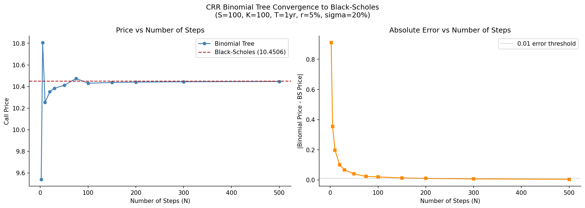
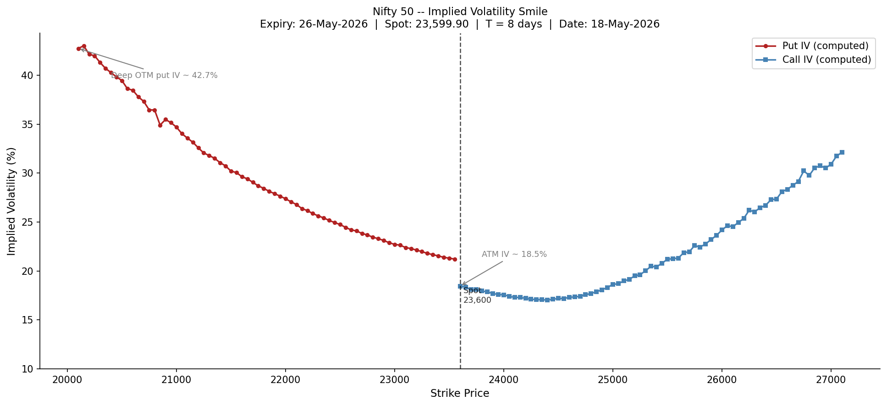

# Options Pricing and Volatility Analysis

**Track:** Resume B - Quantitative Risk & Analytics
**Status:** In progress
**Environment:** Python 3.12 (resume-b)
**Last Updated:** 2026-05

---

## Objective

This project implements European options pricing from first principles and applies
the methodology to live NSE Nifty 50 market data. The goal is to demonstrate that
Black-Scholes is not just a formula to call but a theoretical framework with
testable implications -- and that real market prices systematically violate its
central assumption of constant volatility across strikes. The project covers three
layers: closed-form pricing and Greeks, discrete-time binomial tree pricing with
convergence analysis, and implied volatility extraction from live options chain data
to construct and interpret the volatility smile.

This methodology is used daily by derivatives desks, risk teams, and structured
products groups to quote options, compute hedge ratios, and measure the market's
embedded view of tail risk.

---

## Data Sources

| Dataset | Source | Date | Notes |
|---------|--------|------|-------|
| Nifty 50 Options Chain | https://www.nseindia.com/option-chain | 18-May-2026 | 26-May-2026 expiry, all strikes, downloaded as CSV |
| Hull textbook validation values | Options, Futures and Other Derivatives, Ch. 13 and 17 | -- | S=100, K=100, T=1yr, r=5%, sigma=20% |
| RBI Repo Rate | https://www.rbi.org.in | May 2026 | 6.25% used as risk-free rate proxy |

---

## Methodology

### 1. Black-Scholes Pricing

Implemented the Black-Scholes closed-form pricer for European calls and puts from
first principles using the standard d1/d2 formulation. Validated against Hull
Chapter 13 reference values (call = 10.4506, put = 5.5735 for the standard test
case). Put-call parity confirmed to hold to floating point precision (difference
< 0.00000001), verifying internal consistency between the call and put formulas.

### 2. Analytical Greeks

Derived all five Greeks analytically from the Black-Scholes formula. Delta = N(d1)
is the risk-adjusted probability of expiry in the money and represents the hedge
ratio for a Delta-neutral position. Gamma measures the rate of change of Delta and
peaks at ATM where Delta sensitivity is highest. Vega measures sensitivity to a 1%
change in volatility and is highest for ATM options with time remaining. Theta
measures time decay per calendar day using a 365-day convention. All Greeks
validated against Hull Chapter 17 reference values.

Greeks were plotted against spot price from 60 to 140 (K=100 fixed) to demonstrate
their behaviour across moneyness. The four charts confirm the standard shapes:
Delta as an S-curve, Gamma and Vega as bell curves peaking at ATM, and Theta most
negative at ATM.

### 3. CRR Binomial Tree

Implemented the Cox-Ross-Rubinstein binomial tree pricer with up factor
u = exp(sigma * sqrt(dt)), down factor d = 1/u, and risk-neutral probability
p = (exp(r*dt) - d) / (u - d). Priced the same Hull test case across step counts
from N=2 to N=500 and plotted convergence to the Black-Scholes price.

The tree oscillates around the BS price at low N due to the coarseness of the
discrete approximation, with the oscillation dampening as N increases. Error falls
below 0.01 at N=200 and reaches 0.004 at N=500. The residual error at high N is
a known CRR artifact caused by even/odd step count alternation, not a formula
error. In practice N=100 is sufficient, giving error well within typical bid-ask
spreads.

### 4. Implied Volatility Extraction

Downloaded the live NSE Nifty 50 options chain for the 26-May-2026 expiry (8 days
to expiry, spot = 23,599.90). Parsed 141 strikes from 20,100 to 27,100. Used
Brent's root-finding method to extract the implied volatility from each option's
last traded price by solving BS_price(sigma) - market_price = 0 numerically.
Call prices used for strikes at or above spot; put prices used for strikes below
spot, following the convention of using the more liquid side at each strike.

Computed IVs match NSE's published IV column within 0.2 percentage points across
all strikes, confirming implementation accuracy.

### 5. Volatility Smile

Plotted computed IV against strike price to construct the volatility smile. Under
Black-Scholes, IV should be constant across all strikes -- a flat line at the ATM
level. The observed Nifty smile is strongly asymmetric, showing a pronounced
negative skew characteristic of equity index options globally.

---

## Results

**Black-Scholes validation:**
Call price = 10.4506, Put price = 5.5735 (Hull Ch.13 test case). Put-call parity
difference < 0.00000001.

**Greeks at ATM (S=K=100, T=1yr, r=5%, sigma=20%):**

| Greek | Value | Unit |
|-------|-------|------|
| Delta | 0.6368 | per unit spot move |
| Gamma | 0.0188 | per unit spot move squared |
| Vega  | 0.3752 | per 1% vol move |
| Theta | -0.0176 | per calendar day |
| Rho   | 0.5323 | per 1% rate move |

**Binomial tree convergence:**
Error falls below 0.01 at N=200, reaching 0.004 at N=500. Oscillation pattern
confirms even/odd CRR artifact.

**Volatility smile (Nifty 50, 26-May-2026 expiry, 8 days):**

| Metric | Value |
|--------|-------|
| ATM IV | 18.5% |
| Min IV (call side) | 17.0% at strike 24,400 |
| Max IV (put side) | 43.0% at strike 20,150 |
| Skew spread (OTM put minus OTM call IV) | 8.55pp |

The smile shows a pronounced negative skew. OTM put IV reaches 43% versus ATM IV
of 18.5% -- a 24.5pp premium. OTM call IV rises more gradually to 32% at strike
27,100. The asymmetry reflects institutional demand for downside protection and
the market's pricing of fat left tails not captured by the lognormal distribution
assumed by Black-Scholes.

The short expiry (8 days) amplifies the skew because near-term event risk is priced
more acutely in short-dated options than longer-dated ones.

---

## Limitations

- Black-Scholes assumes constant volatility across strikes and over time. The
  observed smile directly violates this assumption. The model is used here as a
  quoting convention, not a claim that lognormal returns are correct.
- Implied volatilities are extracted from last traded prices (LTP), not bid-ask
  midpoints. For illiquid deep OTM strikes, LTP may be stale, introducing noise
  in the smile at the extremes.
- The risk-free rate is approximated using the RBI repo rate (6.25%). The correct
  rate for short-dated index options would be the overnight MIBOR or the rate
  implied from Nifty futures via put-call parity.
- The binomial tree implemented here prices European options only. American option
  pricing requires an additional early exercise check at each node, which is not
  implemented.
- No dividend adjustment is applied. Nifty 50 pays an implied dividend yield of
  approximately 1.2% annually. For longer-dated options this would meaningfully
  affect pricing; for the 8-day expiry used here the effect is negligible.
- The volatility smile captures a single expiry. A full vol surface would require
  multiple expiries to show the term structure of volatility alongside the skew
  structure across strikes.

---

## References

- Hull, J. (2022). Options, Futures and Other Derivatives (11th ed.). Pearson.
  Chapters 13 (Black-Scholes), 17 (Greeks), 20 (Volatility Smile)
- Cox, J., Ross, S., Rubinstein, M. (1979). Option Pricing: A Simplified Approach.
  Journal of Financial Economics, 7(3), 229-263.
- NSE Options Chain: https://www.nseindia.com/option-chain
- RBI Policy Rates: https://www.rbi.org.in
- SciPy Brent's Method: https://docs.scipy.org/doc/scipy/reference/generated/scipy.optimize.brentq.html
